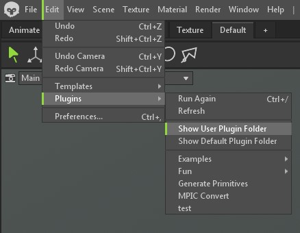
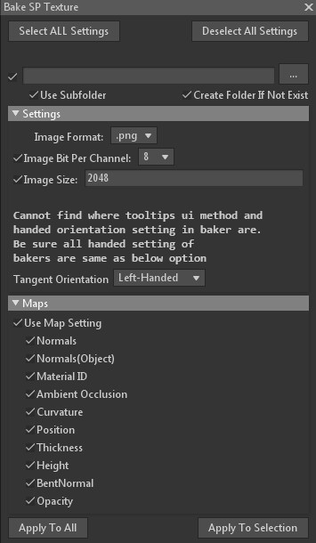

# Marmoset Toolbag Python Plugins

八猴的插件，还是自用

## 安装方法

打开下图的文件夹

将 `armageddon` 文件夹放入打开的文件夹中
并将 `armageddon\plugin_path.txt` 中的：

    C:/Your/Plugin/Directory/Which/Contain/PY/Files

换成这个 `readme.md` 文件所在的路径（不要文件名），比如：

    E:/Python-Scripts-For-DCCs/MarmosetToolbag

## BakeWhatSPLikes

将baker的设置改成Substance Painter能用贴图，包括一些常用选项

可以批处理多个 baker

长这样：

最左边的checkbox可以调整是否批处理这个选项

最上面两个按钮分别是开启所有选项和关闭所有选项

接下来两行是设置导出贴图的路径的，只选择文件夹即可

`use subfolder` 意思是每一个baker都会按baker的名字在所选路径下再生成一个子文件夹

`create folder if not exist` 因为选择不存在的路径八猴不会创建新的，勾上这个可以自动创建新文件夹

### Settings
`image format` 和baker设置一样的后缀

`image bit per channel` 和baker设置一样的每通道位数，一些格式不支持16或32，导出需要注意

`image size` 和baker设置一样的贴图分辨率，不过得手动输入

一串英文，意思是找不到ui的tooltip方法和baker的tangent orientation接口，所以下一个选项要手动输入

`tangent orientation` 与你的默认设置相同，但可能和现有的baker不同，所以请手动确认

>小贴士：sp是左手系，也就是说法线贴图是dx类型的，y轴(g通道)会反转

### Maps

所有sp可能需要的贴图都在这里，opacity没用过不知道是不是alpha test，但也先这么放了

本来想做两个按钮，第一个控制是否在面板显示，第二个才是开启关闭，但还是找不到面板显示的接口，所以贴图想一直留在面板的话就得手动点的