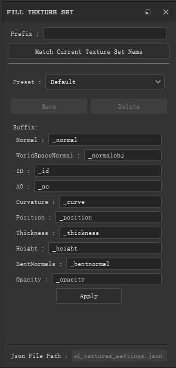
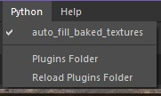
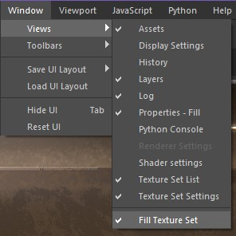

# Substance Painter 插件合集

一些自制插件，使用ide为pycharm

# Auto Fill Baked Textures

一般外部烘焙高模导入时要一张张贴图拖（比如八猴），这个插件可以根据前后缀匹配贴图并自动放到对应位置

## 安装

打开sp，左上角选择python，打开插件文件夹，将三个文件夹放进去即可（一般在 `文档\Adobe\Adobe Substance 3D Painter\python` 下）

安装完成后可以reload一下，不过保险起见最好重启软件

## 打开

首先确认开启插件（勾上）

其次在窗口界面确认打开窗口（还是勾上）

就能看到窗口了

## 用法

1. 把烘焙好的贴图导入进来
2. 在插件界面填写对应前缀(prefix name)后缀(suffix)
3. 确认无误点击apply按钮即可

## 功能

按钮 `Match Current Texture Set Name` 意思是获取当然贴图集的名称，名称一致时比较方便

预设可以储存

## 注意

Default 预设无法更改，新建预设直接在下拉菜单上更改即可

如果开启插件没有看到窗口，在左上角窗口菜单下的第一个子菜单(Views) 看看 Fill Texture Set 有没有√，没有的话点一下

最底下的 `Json File Path` 是储存预设的地方，不能改，为了方便备份才暴露出来的，在插件的 `modules` 文件夹内